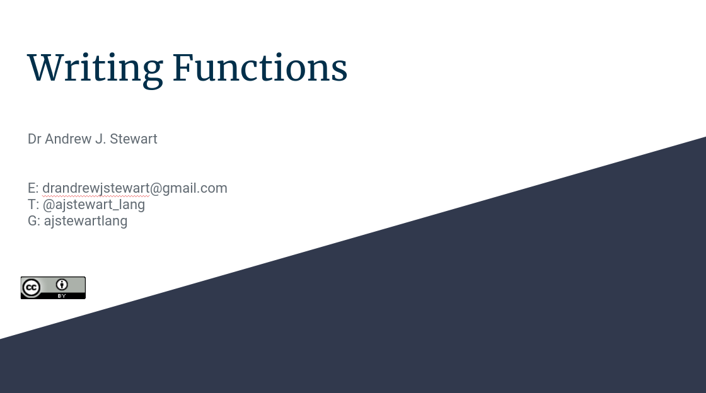

```{r setup, include=FALSE}
knitr::opts_chunk$set(echo = TRUE)
```

# Overview 

<center>

&nbsp;&nbsp;

<iframe width="560" height="315" src="https://youtube.com/embed/" frameborder="0" allowfullscreen></iframe>

&nbsp;&nbsp;

</center>

## Slides

You can download the slides in .odp format by clicking [here](../slides/writing_functions.odp) and in .pdf format by clicking on the image below. 

&nbsp;&nbsp;

<center>

[{width=75%}](../slides/writing_functions.pdf)

</center>

&nbsp;&nbsp;

## Additional Resources

You'll find lots of great information on functions and functional programming in R in [this great book](https://adv-r.hadley.nz/) by Hadley Wickham.

## Improve this Workshop

If you spot any issues/errors in this workshop, you can raise an issue or create a pull request for [this repo](https://github.com/ajstewartlang/21_writing_functions). 